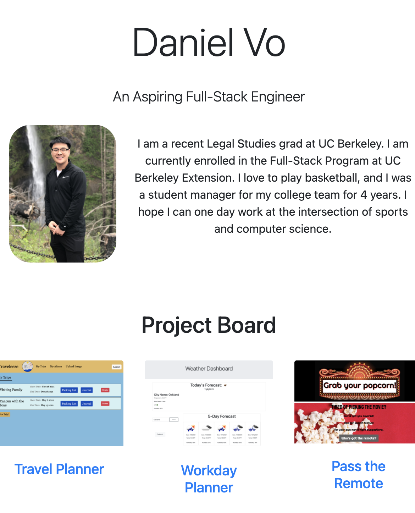

# Portfolio Version3
​I was tasked to edit my portfolio adding more projects that have been deployed. I included basic contact information and links to my github, medium, and linkedin

​
​
## Getting Started
I first created starter files with starter code. I was given specific criteria that needed to be met in this portfolio project. ​
​
​
## Deployed Link
https://danielvo1.github.io/portfolio_v3/
​
## Screenshots
​

​
​
## Built With
​
* [HTML](https://developer.mozilla.org/en-US/docs/Web/HTML)
* [CSS](https://developer.mozilla.org/en-US/docs/Web/CSS)
* [Javascript](https://developer.mozilla.org/en-US/docs/Web/JavaScript)
* [Bootstrap](https://getbootstrap.com/)
​
​
## Authors
​**Daniel Vo** 
​
## Contact
- [Link to Portfolio Site](https://danielvo1.github.io/portfolio_v3/)
- [Link to Github](https://github.com/danielvo1)
- [Link to LinkedIn](https://www.linkedin.com/in/daniel-vo-57b00521b/)
​
